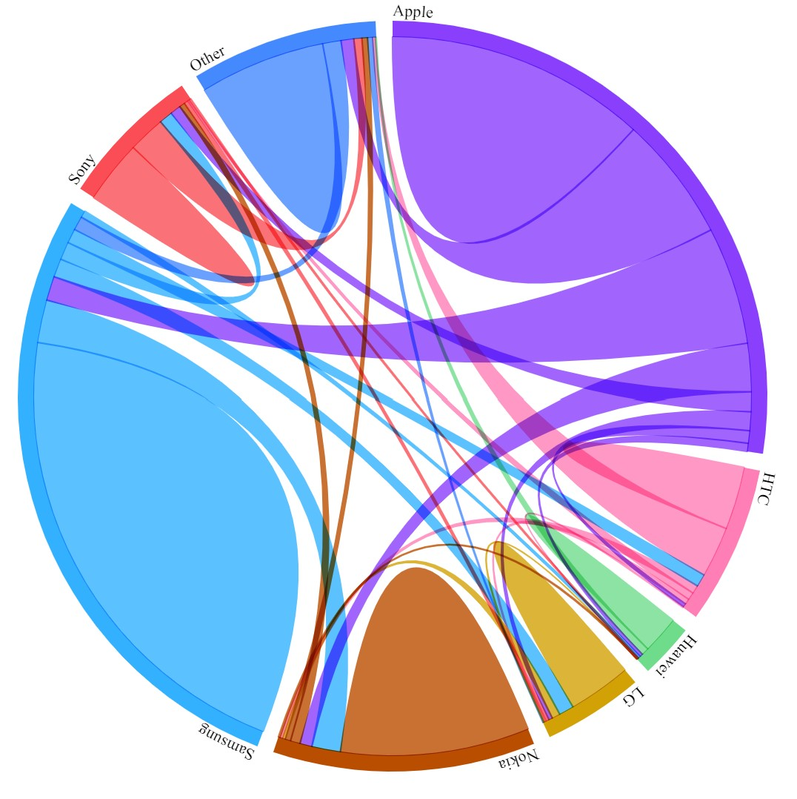

# Chord Diagram in Angular / D3

### by Peter Chapman

This project was generated with [Angular CLI](https://github.com/angular/angular-cli) version 11.2.9.

## Development server

Run `ng serve` for a dev server. Navigate to `http://localhost:4200/`. The app will automatically reload if you change any of the source files.

[Blog post](https://www.peterchapman.org/post/blog-visualisation-chord-angular/)
